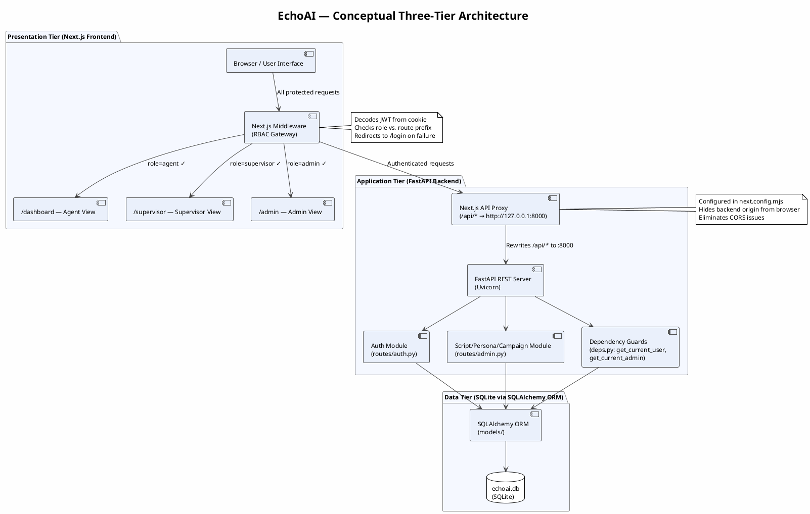
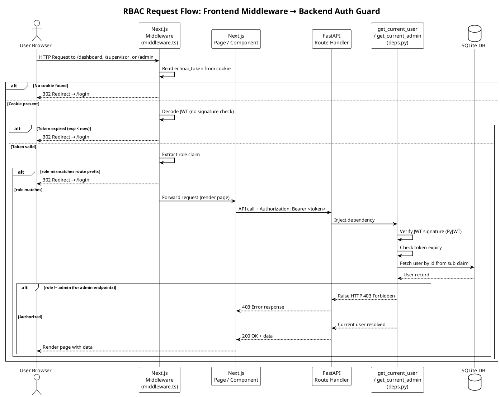
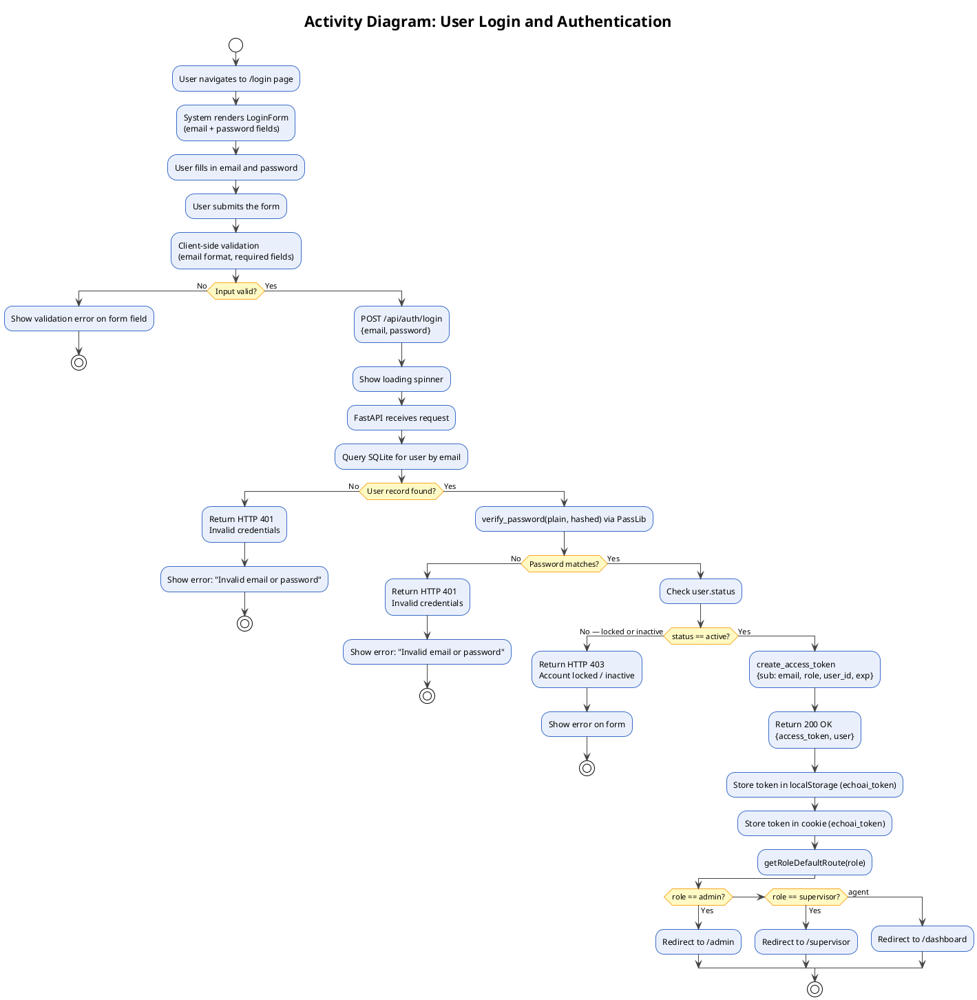
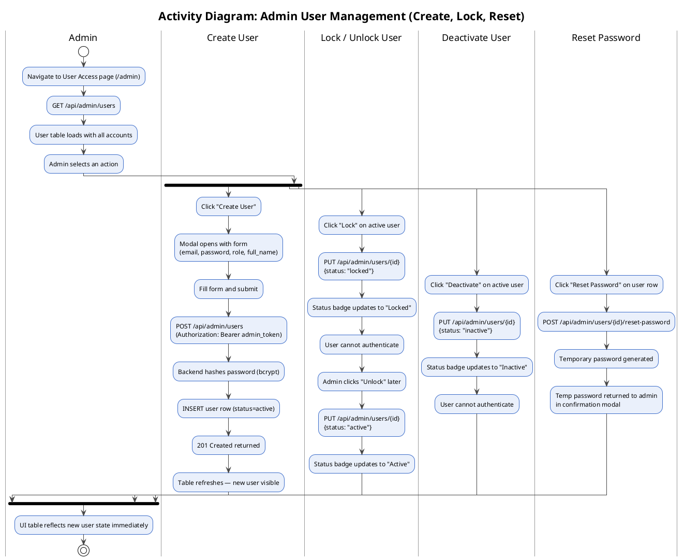
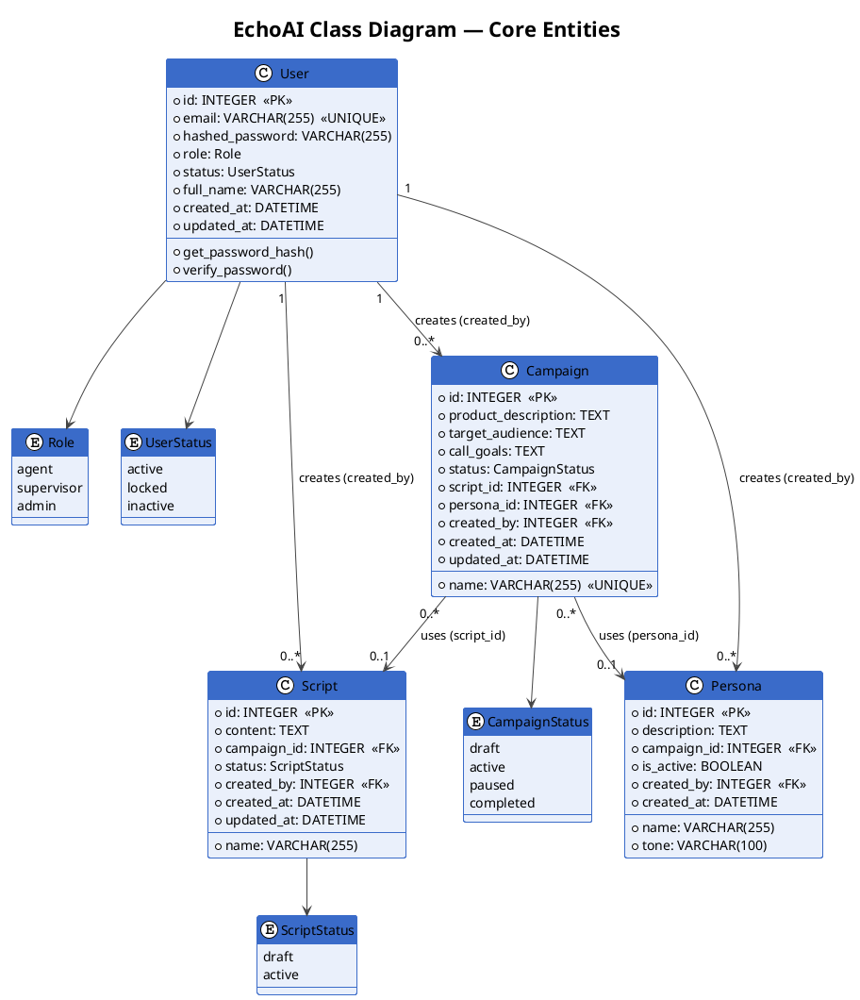
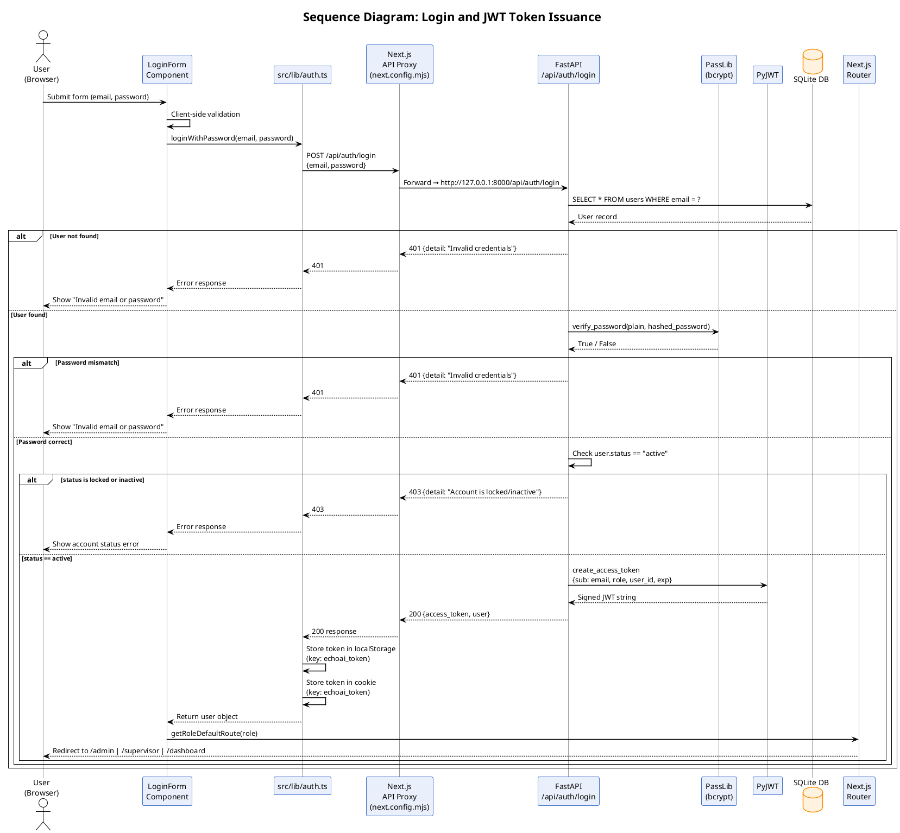
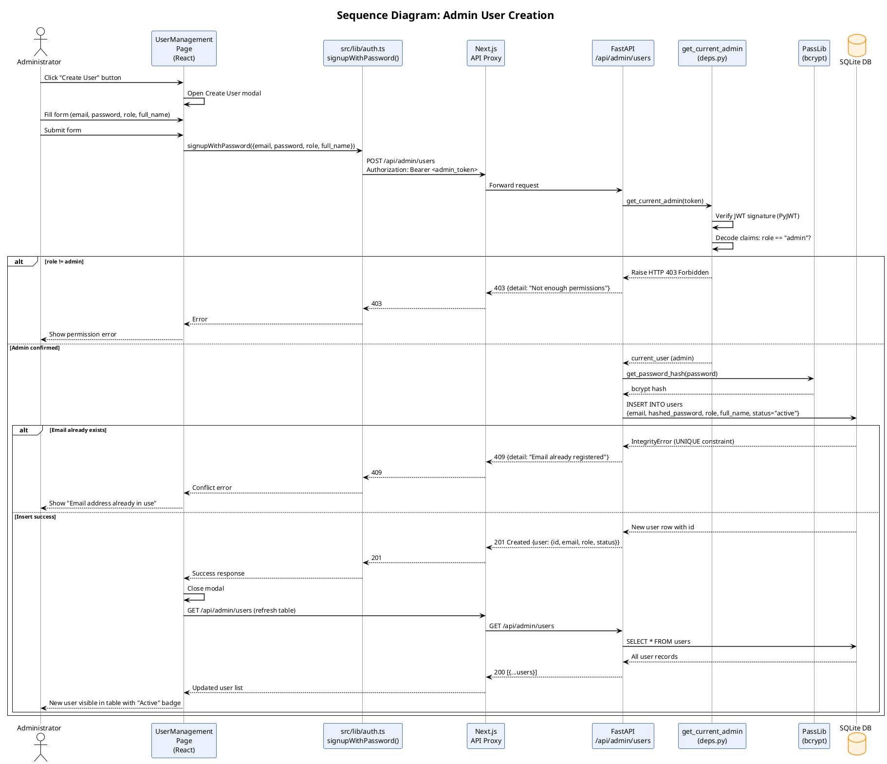
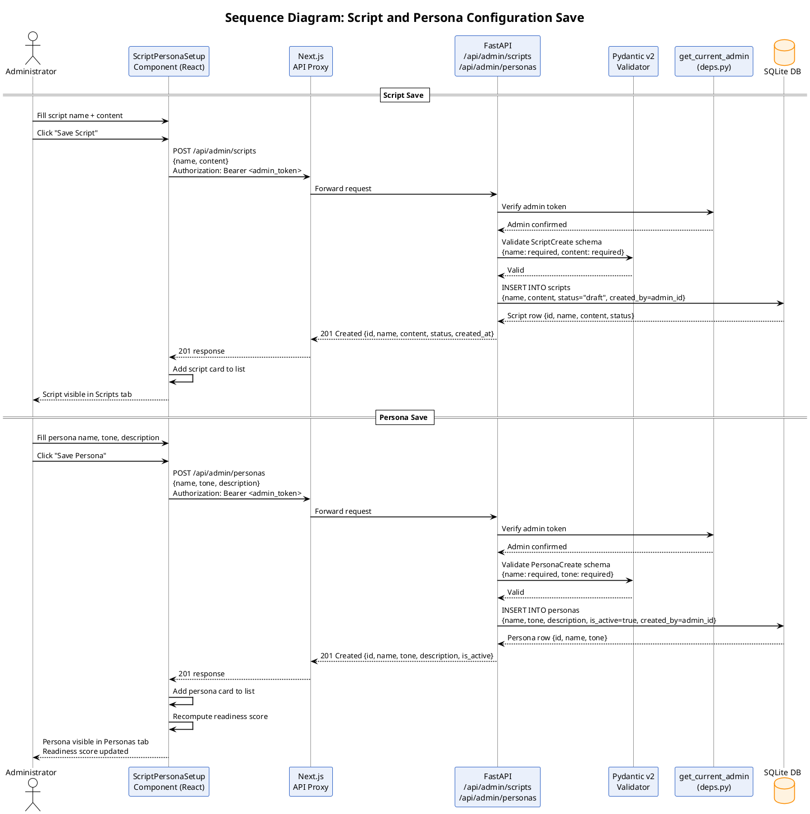
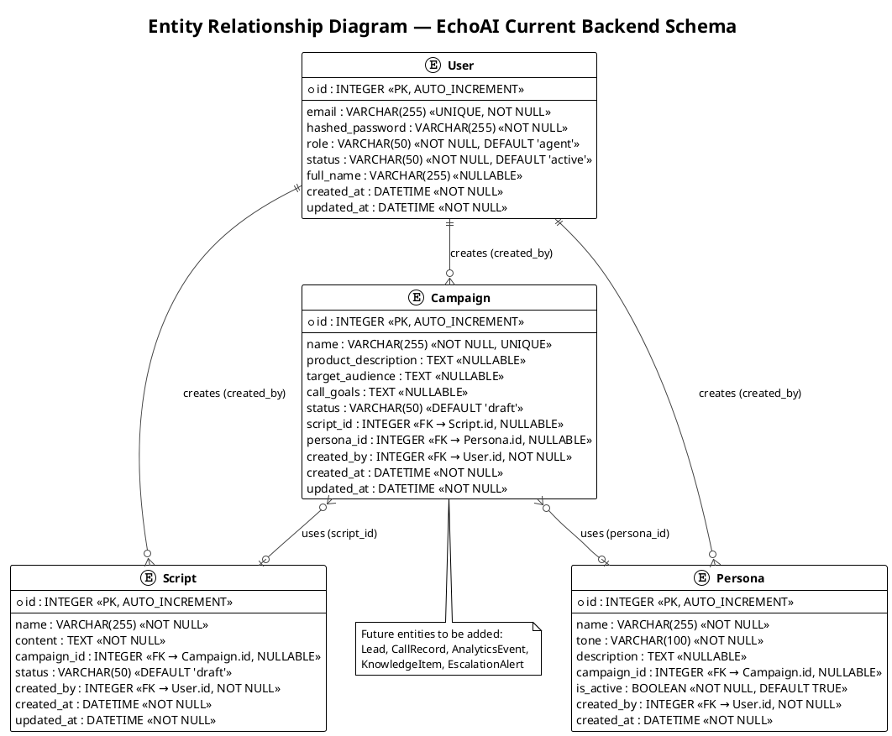
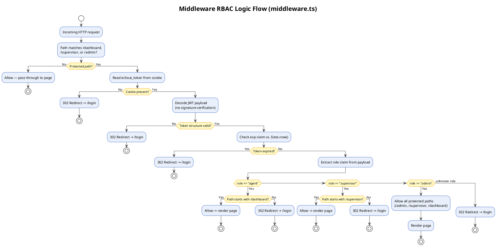

# EchoAI SDS — Complete Figures Reference
## PlantUML Diagrams + Screenshot Guidance

---

# PART A: PLANTUML DIAGRAMS (13 diagrams)
# Copy each block into https://www.plantuml.com/plantuml/uml/ or any PlantUML renderer

---

## FIGURE 3.1 — EchoAI Conceptual Three-Tier Architecture Diagram
**Where:** Chapter 3, Section 3.2 (after the paragraph ending "...protected resources.")
**Type:** Architecture / Component Diagram
**Size hint:** Wide landscape, ~700px wide



---

## FIGURE 3.2 — RBAC Request Flow: Frontend Middleware to Backend Auth Guard
**Where:** Chapter 3, Section 3.3.1 (after paragraph ending "...sensitive operations.")
**Type:** Sequence Diagram
**Size hint:** Portrait, ~600px wide



---

## FIGURE 3.3 — Activity Diagram: User Login and Authentication
**Where:** Chapter 3, Section 3.4.1.1 — Activity Diagram 1 (after "Activity Diagram 1: User Authentication Flow" heading)
**Type:** Activity Diagram
**Size hint:** Portrait, ~500px wide



---

## FIGURE 3.4 — Activity Diagram: Admin Campaign and Script Setup Flow
**Where:** Chapter 3, Section 3.4.1.1 — Activity Diagram 2 (after "Activity Diagram 2: Campaign Creation and Script Setup" heading)
**Type:** Activity Diagram
**Size hint:** Portrait, ~520px wide

```plantuml
@startuml Figure_3_4_Activity_Campaign_Setup
!theme plain
skinparam defaultFontName Arial
skinparam ActivityBackgroundColor #EAF0FB
skinparam ActivityBorderColor #3A6BC9
skinparam ActivityDiamondBackgroundColor #FFF9C4
skinparam ActivityDiamondBorderColor #F9A825
skinparam ArrowColor #444444

title Activity Diagram: Admin Campaign and Script Setup Flow

start
:Admin navigates to Campaigns page (/admin);
:Admin enters campaign details\n(name, description, product info, target audience);
:Click "Save Draft";
:Draft written to localStorage\n(key: echoai_campaign_draft);
:Campaign card appears with "Draft" badge;

:Admin navigates to Script and Persona Setup page;
:System reads echoai_campaign_draft\nand pre-populates context fields;

fork
  :Scripts Tab;
  :Create or upload calling script;
  :POST /api/admin/scripts\n{name, content};
  :Script saved to SQLite;
fork again
  :Personas Tab;
  :Define voice persona\n(professional, empathetic, assertive, or friendly);
  :POST /api/admin/personas\n{name, tone, description};
  :Persona saved to SQLite;
fork again
  :Campaign Context Tab;
  :Fill product description,\ntarget audience, call goals;
end fork

:System computes readiness score\n(script + persona + context completeness);

if (Readiness score == 100%?) then (No)
  :Activate button remains disabled;
  :Admin fills remaining required fields;
  goto :System computes readiness score\n(script + persona + context completeness);
else (Yes)
  :Activate button becomes enabled;
  :Admin clicks "Activate Campaign";
  :POST /api/admin/campaigns/{id}/activate;
  :Campaign status: draft → active;
  :Campaign available for agent use;
  stop
endif
@enduml
```

---

## FIGURE 3.5 — Activity Diagram: Admin User Management (Create, Lock, Reset)
**Where:** Chapter 3, Section 3.4.1.1 — Activity Diagram 3 (after "Activity Diagram 3: Admin User Management" heading)
**Type:** Activity Diagram
**Size hint:** Wide landscape, ~750px wide



---

## FIGURE 3.6 — EchoAI Class Diagram (Core Entities)
**Where:** Chapter 3, Section 3.4.1.2 (after "Figure 3.6" caption)
**Type:** Class Diagram
**Size hint:** Wide landscape, ~800px wide



---

## FIGURE 3.7 — Sequence Diagram: Login and JWT Token Issuance
**Where:** Chapter 3, Section 3.4.1.3 — Sequence Diagram 1 (after "Figure 3.7" caption, before Table 3.2)
**Type:** Sequence Diagram
**Note:** Table 3.2 already documents the steps — this diagram is the visual version of it
**Size hint:** Wide, ~750px wide



---

## FIGURE 3.8 — Sequence Diagram: Admin User Creation
**Where:** Chapter 3, Section 3.4.1.3 — Sequence Diagram 2 (after "Figure 3.8" caption)
**Type:** Sequence Diagram
**Size hint:** Wide, ~720px wide



---

## FIGURE 3.9 — Sequence Diagram: Script and Persona Configuration Save
**Where:** Chapter 3, Section 3.4.1.3 — Sequence Diagram 3 (after "Figure 3.9" caption)
**Type:** Sequence Diagram
**Size hint:** Wide, ~720px wide



---

## FIGURE 3.10 — State Transition Diagram: User Account Status Lifecycle
**Where:** Chapter 3, Section 3.4.1.4 — State Diagram 1 (after "Figure 3.10" caption)
**Type:** State Diagram
**Size hint:** Portrait, ~480px wide

```plantuml
@startuml Figure_3_10_State_User_Account
!theme plain
skinparam defaultFontName Arial
skinparam stateBackgroundColor #EAF0FB
skinparam stateBorderColor #3A6BC9
skinparam stateArrowColor #444444
skinparam noteBackgroundColor #FFFDE7
skinparam noteBorderColor #F9A825

title State Transition Diagram: User Account Status Lifecycle

[*] --> Pending : Admin submits\nCreate User form

state Pending {
  : Account created, not yet confirmed
}

Pending --> Active : POST /api/admin/users\n201 Created — account initialized

state Active {
  : Can authenticate (login)
  : Can access role routes
  : Password reset allowed
}

Active --> Locked : Admin clicks Lock\nPUT .../{id} {status: "locked"}
Active --> Inactive : Admin clicks Deactivate\nPUT .../{id} {status: "inactive"}
Active --> Active : Admin resets password\nPOST .../{id}/reset-password

state Locked {
  : Cannot authenticate
  : Login returns 403 Account Locked
  : All sessions effectively invalid
}

state Inactive {
  : Cannot authenticate
  : Login returns 403 Account Inactive
  : Requires admin to reactivate
}

Locked --> Active : Admin clicks Unlock\nPUT .../{id} {status: "active"}
Inactive --> Active : Admin reactivates\nPUT .../{id} {status: "active"}

Locked --> [*] : Permanently removed\n(future: DELETE endpoint)
Inactive --> [*] : Permanently removed\n(future: DELETE endpoint)

note right of Active
  Default state when
  account is first created
end note

note right of Locked
  Temporary suspension.
  Configuration preserved.
  Reversible by admin.
end note

note right of Inactive
  Permanent suspension.
  Requires explicit
  admin reactivation.
end note
@enduml
```

---

## FIGURE 3.11 — State Transition Diagram: Campaign Lifecycle
**Where:** Chapter 3, Section 3.4.1.4 — State Diagram 2 (after "Figure 3.11" caption)
**Type:** State Diagram
**Size hint:** Portrait, ~480px wide

```plantuml
@startuml Figure_3_11_State_Campaign_Lifecycle
!theme plain
skinparam defaultFontName Arial
skinparam stateBackgroundColor #EAF0FB
skinparam stateBorderColor #3A6BC9
skinparam stateArrowColor #444444
skinparam noteBackgroundColor #FFFDE7
skinparam noteBorderColor #F9A825

title State Transition Diagram: Campaign Lifecycle

[*] --> Draft : Admin creates campaign\nPOST /api/admin/campaigns

state Draft {
  : Script and Persona being configured
  : Readiness score < 100%
  : Activate button disabled
  : Campaign context in localStorage
}

Draft --> Draft : Admin edits script,\npersona, context fields\n(PUT /api/admin/scripts, personas)

Draft --> Active : Readiness == 100%,\nAdmin clicks Activate\nPOST .../campaigns/{id}/activate

state Active {
  : Available for agent call operations
  : Script/Persona locked in
  : Live metrics displayed (future)
  : Agents see campaign in dashboard
}

Active --> Paused : Admin clicks Pause\nPOST .../campaigns/{id}/pause

state Paused {
  : Operations suspended
  : Configuration preserved
  : Agents cannot use campaign
}

Paused --> Active : Admin clicks Resume\nPOST .../campaigns/{id}/activate

Active --> Completed : Target call volume reached\nor campaign end date passed

state Completed {
  : No longer accepting calls
  : Historical data preserved
  : Read-only state
}

Completed --> Archived : System auto-archives\n(future sprint)

state Archived {
  : Cannot be modified directly
  : Available for reporting only
}

Archived --> [*]

note left of Draft
  echoai_campaign_draft
  written to localStorage
  during setup phase
end note

note right of Active
  Campaign data available
  to agents via
  /api/admin/campaigns
end note
@enduml
```

---

## FIGURE 3.12 — Entity Relationship Diagram (ERD)
**Where:** Chapter 3, Section 3.5.3 (after "Figure 3.12" caption)
**Type:** ERD / Entity Diagram
**Size hint:** Wide landscape, ~750px wide



---

## FIGURE 4.3 — Middleware RBAC Logic Flow Diagram
**Where:** Chapter 4, Section 4.2.1.6 (after paragraph ending "...without a round-trip to the backend.")
**Type:** Flowchart / Activity Diagram
**Size hint:** Portrait, ~500px wide



---
---

# PART B: NON-PLANTUML FIGURES (Screenshots + Design Reference)
# These need actual screenshots from your running application OR manual mockups

---

## FIGURE 3.13 — EchoAI Design System Color Palette and Typography Scale
**Where:** Chapter 3, Section 3.6.2 (after bullet list, before Chapter 4)
**Type:** Design reference image — create manually or as a simple graphic
**What to show:**
- Color swatches with hex values (from Table 4.4):
  - Primary Background: #0A0E1A (deep navy)
  - Surface/Card: #111827, #1F2937 (dark blue-gray)
  - Accent/Action: #3B82F6 → #2563EB (electric blue)
  - Success: #10B981 (emerald green)
  - Warning: #F59E0B (amber)
  - Error: #EF4444 (rose red)
  - Text Primary: #F9FAFB (near-white)
  - Text Secondary: #9CA3AF (light gray)
  - Border: #374151 (dark border)
- Typography: Show font used (Tailwind default, typically Inter or system-ui)
- Can be a simple color swatch grid with labels
**Suggested tool:** Figma, Canva, or a simple HTML color swatch page screenshot

---

## FIGURE 4.1 — Authentication Module: Code Structure in echoai-backend/app/
**Where:** Chapter 4, Section 4.2.1.1 (after paragraph ending "...database for every request.")
**Type:** Screenshot of your actual file tree
**What to show:** Terminal or VS Code explorer showing:
```
echoai-backend/
└── app/
    ├── main.py
    ├── core/
    │   ├── config.py         ← JWT secret, token expiry
    │   └── security.py       ← get_password_hash, verify_password, create_access_token
    ├── api/
    │   ├── deps.py           ← get_current_user, get_current_admin
    │   └── routes/
    │       ├── auth.py       ← POST /auth/login, POST /auth/signup
    │       └── admin.py      ← user/script/persona/campaign endpoints
    ├── models/
    │   └── user.py           ← User SQLAlchemy model
    └── schemas/
        └── user.py           ← UserCreate, UserResponse Pydantic schemas
```
**How to get it:** Run `tree echoai-backend/app/` in terminal and screenshot, or use VS Code sidebar

---

## FIGURE 4.2 — Screenshot: Login Page (EchoAI Frontend)
**Where:** Chapter 4, Section 4.2.1.3 (after token payload paragraph)
**URL to screenshot:** http://localhost:3000/login
**What must be visible:** Email field, password field, submit button, EchoAI branding, dark theme

---

## FIGURE 4.4 — Screenshot: Script and Persona Setup, Admin Interface
**Where:** Chapter 4, Section 4.2.2.1 (after Script Management paragraph)
**URL to screenshot:** http://localhost:3000/admin → Script/Persona Setup
**What must be visible:** Three tabs (Scripts, Personas, Campaign Context), script list, editor textarea

---

## FIGURE 4.5 — Screenshot: Campaigns Page, Admin Interface
**Where:** Chapter 4, Section 4.2.2.3 (after Campaign Management paragraph)
**URL to screenshot:** http://localhost:3000/admin → Campaigns
**What must be visible:** Campaign cards with status badges (Draft/Active), readiness percentage, action buttons

---

## FIGURE 4.6 — Screenshot: EchoAI Landing Page
**Where:** Chapter 4, Section 4.3.1
**URL to screenshot:** http://localhost:3000/ (unauthenticated)
**What must be visible:** Marketing landing content, "Login" navigation link, EchoAI branding

---

## FIGURE 4.7 — Screenshot: Login Page with Form Validation
**Where:** Chapter 4, Section 4.3.1 (after Figure 4.6)
**URL to screenshot:** http://localhost:3000/login — deliberately submit empty/bad email
**What must be visible:** Red validation error message under email field (e.g., "Please enter a valid email address")

---

## FIGURE 4.8 — Screenshot: Agent Dashboard, Main Interface
**Where:** Chapter 4, Section 4.3.2
**URL to screenshot:** http://localhost:3000/dashboard (login as agent)
**What must be visible:** Live Call Panel, Lead Queue, Performance Metrics Bar, Script Prompter, AI Suggestion Feed

---

## FIGURE 4.9 — Screenshot: Supervisor Dashboard, Team Monitoring View
**Where:** Chapter 4, Section 4.3.3
**URL to screenshot:** http://localhost:3000/supervisor (login as supervisor)
**What must be visible:** Team Overview Grid of agent cards, Escalation Alert Panel, Performance Analytics Summary

---

## FIGURE 4.10 — Screenshot: Admin Overview Dashboard
**Where:** Chapter 4, Section 4.3.4.1
**URL to screenshot:** http://localhost:3000/admin (login as admin)
**What must be visible:** System-wide KPI cards, quick-access tiles to all admin sub-pages

---

## FIGURE 4.11 — Screenshot: User Access Management Page
**Where:** Chapter 4, Section 4.3.4.2
**URL to screenshot:** http://localhost:3000/admin → User Access
**What must be visible:** Sortable user table, role badges, status badges, Lock/Unlock/Deactivate buttons

---

## FIGURE 4.12 — Screenshot: Global Analytics Page
**Where:** Chapter 4, Section 4.3.4.6
**URL to screenshot:** http://localhost:3000/admin → Analytics
**What must be visible:** Call volume chart, sentiment distribution, conversion rate cards (mock data)

---

## FIGURE 4.13 — Screenshot: Login Page, Email/Password Fields and Submit
**Where:** Chapter 4, Section 4.5 — Authentication Screens
**Same as Figure 4.2** — can reuse the same screenshot or show a clean idle state (no errors)

---

## FIGURE 4.14 — Screenshot: Signup Page, Admin User Creation Form
**Where:** Chapter 4, Section 4.5 — Authentication Screens
**URL to screenshot:** http://localhost:3000/signup (must be logged in as admin to access)
**What must be visible:** Email, password, role selector, full_name fields, submit button

---

## FIGURE 4.15 — Screenshot: Agent Dashboard, Full Interface with Live Call Panel
**Where:** Chapter 4, Section 4.5 — Agent Screens
**Same as Figure 4.8** or a wider crop showing the full layout

---

## FIGURE 4.16 — Screenshot: Agent Dashboard, Script Prompter and AI Suggestions
**Where:** Chapter 4, Section 4.5 — Agent Screens
**URL to screenshot:** http://localhost:3000/dashboard — crop/focus on the right-side panels
**What must be visible:** Script Prompter with highlighted section + AI Suggestion Feed sidebar

---

## FIGURE 4.17 — Screenshot: Agent Dashboard, Lead Queue Panel
**Where:** Chapter 4, Section 4.5 — Agent Screens
**URL to screenshot:** http://localhost:3000/dashboard — crop/focus on Lead Queue
**What must be visible:** Lead list with score badges, contact details, quick-dial buttons

---

## FIGURE 4.18 — Screenshot: Supervisor Dashboard, Team Monitoring Grid
**Where:** Chapter 4, Section 4.5 — Supervisor Screens
**Same as Figure 4.9** or focus on the agent cards grid specifically

---

## FIGURE 4.19 — Screenshot: Supervisor Dashboard, Escalation Alert Panel
**Where:** Chapter 4, Section 4.5 — Supervisor Screens
**URL to screenshot:** http://localhost:3000/supervisor — focus on escalation panel
**What must be visible:** Live escalation feed with call details and "Take Over / Advise" buttons

---

## FIGURE 4.20 — Screenshot: Admin Overview Dashboard
**Where:** Chapter 4, Section 4.5 — Admin Screens
**Same as Figure 4.10**

---

## FIGURE 4.21 — Screenshot: User Access Management, User Table with Actions
**Where:** Chapter 4, Section 4.5 — Admin Screens
**Same as Figure 4.11** or a closer crop of the table itself

---

## FIGURE 4.22 — Screenshot: User Access Management, Create User Modal
**Where:** Chapter 4, Section 4.5 — Admin Screens
**URL to screenshot:** http://localhost:3000/admin → User Access → click "Create User"
**What must be visible:** Open modal with email, password, role dropdown, name fields

---

## FIGURE 4.23 — Screenshot: Campaigns Page, Campaign Cards Grid
**Where:** Chapter 4, Section 4.5 — Admin Screens
**Same as Figure 4.5** or focus on the cards grid layout

---

## FIGURE 4.24 — Screenshot: Script and Persona Setup, Scripts Tab
**Where:** Chapter 4, Section 4.5 — Admin Screens
**URL to screenshot:** http://localhost:3000/admin → Script/Persona Setup → Scripts tab
**What must be visible:** Script list, "New Script" button, editor panel open

---

## FIGURE 4.25 — Screenshot: Script and Persona Setup, Personas Tab
**Where:** Chapter 4, Section 4.5 — Admin Screens
**URL to screenshot:** http://localhost:3000/admin → Script/Persona Setup → Personas tab
**What must be visible:** Persona cards with tone badges (Professional, Empathetic, etc.)

---

## FIGURE 4.26 — Screenshot: Knowledge Base Page, Item List with Filter
**Where:** Chapter 4, Section 4.5 — Admin Screens
**URL to screenshot:** http://localhost:3000/admin → Knowledge Base
**What must be visible:** Category-filtered list of knowledge items, search bar, toggle buttons

---

## FIGURE 4.27 — Screenshot: Global Analytics Dashboard
**Where:** Chapter 4, Section 4.5 — Admin Screens
**Same as Figure 4.12**

---

## FIGURE 4.28 — Screenshot: Leads and CRM Page
**Where:** Chapter 4, Section 4.5 — Admin Screens
**URL to screenshot:** http://localhost:3000/admin → Leads/CRM
**What must be visible:** Sortable lead table, color-coded score badges (red→green), lead detail panel

---

## FIGURE 4.29 — Screenshot: Security and Access, Event Log
**Where:** Chapter 4, Section 4.5 — Admin Screens
**URL to screenshot:** http://localhost:3000/admin → Security/Access
**What must be visible:** Simulated auth event log (timestamps, IPs, usernames), policy config panels

---

## FIGURE 4.30 — Screenshot: System Settings Page
**Where:** Chapter 4, Section 4.5 — Admin Screens
**URL to screenshot:** http://localhost:3000/admin → System Settings
**What must be visible:** Accordion sections for general info, notifications, integrations, API keys

---

# QUICK SUMMARY TABLE

| Figure | Type | How to Create |
|--------|------|---------------|
| 3.1 | Architecture Diagram | PlantUML above |
| 3.2 | Sequence Diagram | PlantUML above |
| 3.3 | Activity Diagram | PlantUML above |
| 3.4 | Activity Diagram | PlantUML above |
| 3.5 | Activity Diagram (Swimlane) | PlantUML above |
| 3.6 | Class Diagram | PlantUML above |
| 3.7 | Sequence Diagram | PlantUML above |
| 3.8 | Sequence Diagram | PlantUML above |
| 3.9 | Sequence Diagram | PlantUML above |
| 3.10 | State Diagram | PlantUML above |
| 3.11 | State Diagram | PlantUML above |
| 3.12 | ERD | PlantUML above |
| 3.13 | Color/Typography Reference | Manual (Figma/Canva) |
| 4.1 | Code Tree Screenshot | Terminal: tree echoai-backend/app/ |
| 4.2 | UI Screenshot | localhost:3000/login |
| 4.3 | Flow Diagram | PlantUML above |
| 4.4 | UI Screenshot | localhost:3000/admin → Script/Persona Setup |
| 4.5 | UI Screenshot | localhost:3000/admin → Campaigns |
| 4.6 | UI Screenshot | localhost:3000/ (unauthenticated) |
| 4.7 | UI Screenshot | localhost:3000/login (trigger validation) |
| 4.8 | UI Screenshot | localhost:3000/dashboard (as agent) |
| 4.9 | UI Screenshot | localhost:3000/supervisor (as supervisor) |
| 4.10 | UI Screenshot | localhost:3000/admin |
| 4.11 | UI Screenshot | localhost:3000/admin → User Access |
| 4.12 | UI Screenshot | localhost:3000/admin → Analytics |
| 4.13 | UI Screenshot | Reuse 4.2 |
| 4.14 | UI Screenshot | localhost:3000/signup (as admin) |
| 4.15 | UI Screenshot | Reuse 4.8 (full width) |
| 4.16 | UI Screenshot | localhost:3000/dashboard (Script Prompter crop) |
| 4.17 | UI Screenshot | localhost:3000/dashboard (Lead Queue crop) |
| 4.18 | UI Screenshot | Reuse 4.9 (Grid crop) |
| 4.19 | UI Screenshot | localhost:3000/supervisor (Escalation crop) |
| 4.20 | UI Screenshot | Reuse 4.10 |
| 4.21 | UI Screenshot | Reuse 4.11 (Table crop) |
| 4.22 | UI Screenshot | localhost:3000/admin → User Access → Create User modal open |
| 4.23 | UI Screenshot | Reuse 4.5 (Cards crop) |
| 4.24 | UI Screenshot | localhost:3000/admin → Script/Persona → Scripts tab |
| 4.25 | UI Screenshot | localhost:3000/admin → Script/Persona → Personas tab |
| 4.26 | UI Screenshot | localhost:3000/admin → Knowledge Base |
| 4.27 | UI Screenshot | Reuse 4.12 |
| 4.28 | UI Screenshot | localhost:3000/admin → Leads/CRM |
| 4.29 | UI Screenshot | localhost:3000/admin → Security/Access |
| 4.30 | UI Screenshot | localhost:3000/admin → System Settings |